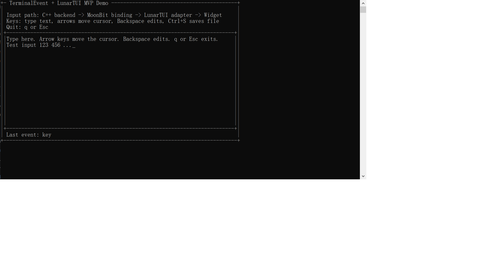

# TextEditor

TextEditor is a small MoonBit terminal editor demo that exercises the published TerminalEvent, LunarEvent, and LunarTUI packages together.

It is intentionally minimal: the goal is to validate the event pipeline, widget event handling, redraw behavior, and file saving path after the projects are consumed from mooncake instead of a local `moon.work` workspace.

## Screenshots

Typing text in the editor:



Saving the buffer to disk:


## Dependency Chain

```text
TerminalEvent C++ core
  -> TerminalEvent C FFI
  -> LunarEvent MoonBit event API
  -> LunarEvent/lunartui adapter
  -> LunarTUI widget event handling
  -> TextEditor redraw loop
```

The repository has no `moon.work`; dependencies are resolved from mooncake:

```moonbit
import {
  "FrozenLemonTee/LunarEvent@0.1.0",
  "FrozenLemonTee/LunarTUI@0.0.2",
  "moonbitlang/x@0.4.40",
}
```

## Run

```bash
moon update
moon run cmd/main
```

The demo is designed for a POSIX terminal. On Windows, the current TerminalEvent backend may report raw mode as unavailable unless the program is run in a compatible POSIX terminal environment such as WSL.

## Controls

- Type text to insert characters at the cursor.
- Arrow keys move the cursor.
- `Backspace` edits text.
- `Tab` inserts two spaces.
- `Enter` inserts a new line.
- `Ctrl+S` saves the buffer to `terminal-event-demo.txt`.
- `q` or `Esc` exits and restores the terminal.

## Test

```bash
moon test cmd/main --target native
```

The tests cover line serialization and file saving.

## Related Projects

- [TerminalEvent](https://github.com/FrozenLemonTee/TerminalEvent)
- [LunarEvent](https://github.com/FrozenLemonTee/LunarEvent)
- [LunarTUI](https://github.com/FrozenLemonTee/LunarTUI)
